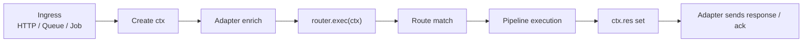
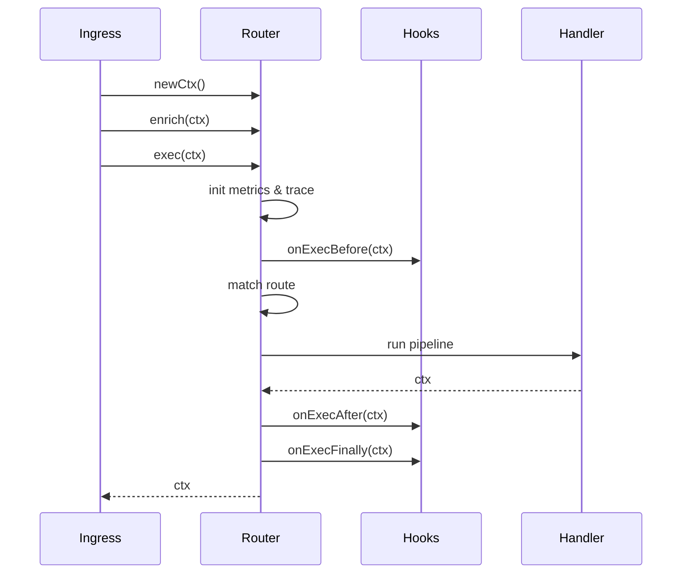

# ctx-router

A transport-agnostic router built around a single execution context.

Write your business logic once. Run it over HTTP, events, jobs, queues, or anything else — without rewriting handlers.

## Why ctx-router exists

Most applications start simple:

- HTTP with Express / Fastify
- A few REST endpoints
- Some middleware

Then reality hits:

- You add background jobs (SQS, Kafka, cron)
- You need async workers
- You want to reuse business logic
- You deploy to Lambda or another runtime
- You end up duplicating logic across transports

The problem is not routing.
The problem is transport leakage into business logic.

## What ctx-router is

ctx-router is a routing + execution layer that:

- Normalizes all ingress types into a single context
- Routes based on patterns, not frameworks
- Executes logic as a linear pipeline
- Keeps transport concerns outside your business code

It is not:

- A web framework
- An HTTP abstraction
- A DI container

It is a context router.

## Core idea (one sentence)

Everything becomes a ctx. Routes select a pipeline. Pipelines mutate the ctx.

## High-level flow



## Key concepts (read in order)

### 1. Context (ctx)

The single object that flows through your entire system.

- Created once per request / event
- Mutated by middleware and handlers
- Returned at the end

Business logic never touches raw framework objects.

### 2. Routes are patterns

Routes are identified by patterns, not concrete values.

Examples:

- `user.:id.detail`
- `job.:resource.clean`
- `GET /user/:id`

Patterns:

- are low-cardinality
- are safe to log & index
- are the identity of a route

Raw values are kept separately.

### 3. Pipelines are linear

Every route resolves to a prebuilt pipeline:

```
[ middleware1 → middleware2 → handler ]
```

- Always sequential
- Always awaited
- No fan-out
- No magic

### 4. Build-time vs runtime

| Phase      | What happens                               |
| ---------- | ------------------------------------------ |
| Build time | `route()`, `via()`, `to()` build pipelines |
| Runtime    | `exec(ctx)` selects & runs a pipeline      |

The runtime never sees the DSL.

## Installation

```bash
npm install ctx-router
```

## Minimal example

### `router.ts`

```typescript
import { CtxRouter, TDefaultCtx } from "ctx-router";
import * as api from "./api";

export type TCtx = TDefaultCtx & {
  user: { role: string[] };
};

export const router = new CtxRouter<TCtx>();

router.route("GET /health/ping").to(api.health.ping);

const userRouter = router.route("user").via(rateLimit, auth);

userRouter.route("POST /update").to(api.user.update);
userRouter.route("GET /:userId").to(api.user.detail);
userRouter.route("detail").to(api.user.detail);
```

### `server.ts` (Express example)

```typescript
import express from "express";
import { adapter } from "ctx-router";
import { router, TCtx } from "./router";

const app = express();
app.use(express.json());

app.use(async (req, res) => {
  const ctx: TCtx = router.newCtx();
  adapter.enrichFromExpress(ctx, req, res);

  await router.exec(ctx);

  res.status(ctx.res.code === "OK" ? 200 : 400).json(ctx.res);
});

app.listen(3000);
```

The same router works for Lambda, SQS, Kafka, cron jobs, etc.

## Routing DSL

### `route(segment)`

Adds a prefix segment.

```typescript
router.route("user").route(":id").route("detail");
```

Builds the pattern:

```
user.:id.detail
```

### `via(...middleware)`

Adds middleware to the pipeline.

```typescript
route("x").via(auth, validate).to(handler);
```

- Sequential
- Awaited
- Mutates ctx

### `to(handler)`

Registers the terminal handler.

- Exactly one handler
- Ends the pipeline
- Build-time only
- Returns void

## Execution lifecycle (authoritative)



## Hooks (system lifecycle)

Hooks wrap execution, not routing DSL.

```typescript
router.hook.onExec.before(async (ctx) => {
  console.log("request in", ctx.id);
});

router.hook.onExec.error(async (ctx, err) => {
  ctx.res.code = "ERROR";
});
```

Available hooks:

- `onExec.before`
- `onExec.after`
- `onExec.error`
- `onExec.finally`

Hooks are side-effect only and mutate ctx directly.

## Error handling

ctx-router provides a structured error system.

### Define your error class

```typescript
class AppError extends CtxBaseError {
  constructor(e) {
    super(e);
  }
}
```

### Create error map

```typescript
export const appErr = ctxErrMap(AppError, {
  auth: {
    UNAUTHORIZED: "Unauthorized",
  },
  general: {
    UNKNOWN_ERROR: "Something went wrong",
  },
});
```

### Throw anywhere

```typescript
throw appErr.auth.UNAUTHORIZED({
  data: { reason: "missing_token" },
});
```

Router errors and app errors are cleanly separated.

## Design guarantees

- Transport-agnostic
- Pattern-first routing
- Low cardinality by design
- Linear, deterministic execution
- No hidden parallelism
- No framework lock-in

## When should you use ctx-router?

Use it if you:

- Share logic between HTTP + jobs
- Want clean boundaries between transport and business logic
- Care about observability and routing identity
- Prefer explicit, boring execution models

Do not use it if you want:

- Automatic DI
- Controllers / decorators
- Magic middleware behavior

## Status

- First public release
- API intentionally small
- Focused on correctness over features

## License

MIT © Kaushik R Bangera
